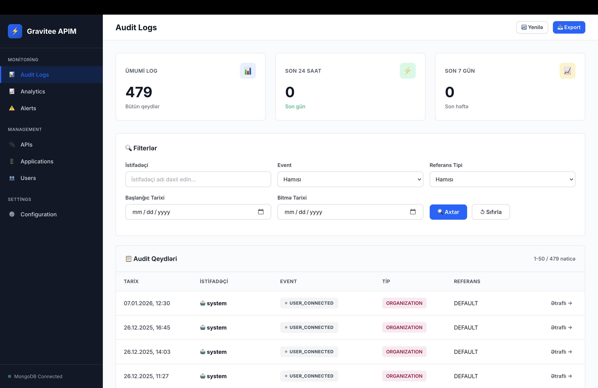
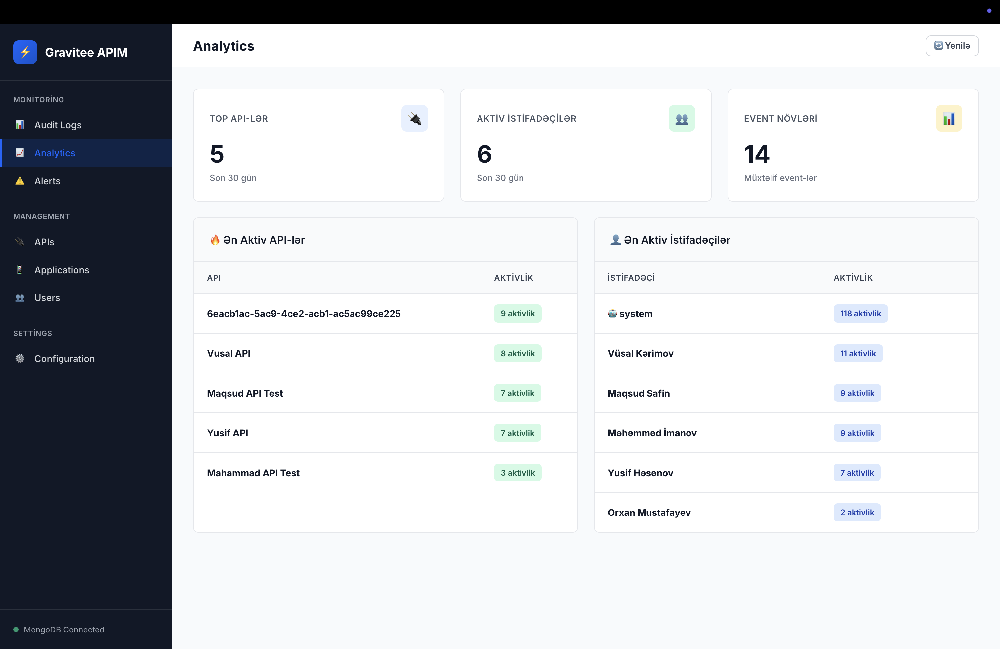
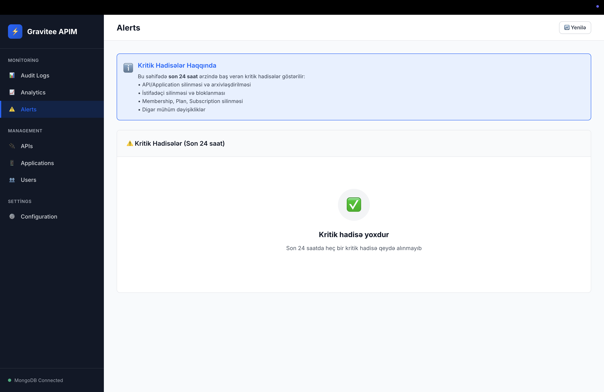
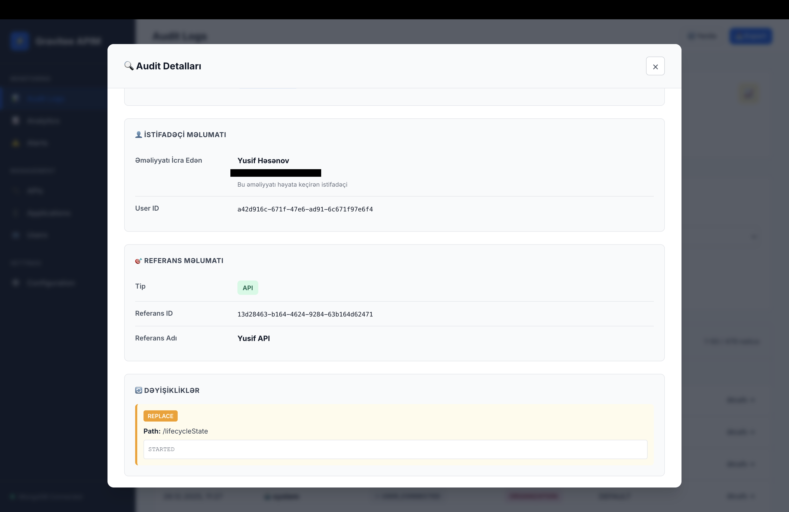

# Gravitee APIM Audit Log Viewer

Modern və professional web interfeysi ilə MongoDB-dən Gravitee APIM audit loglarını izləyə və təhlil edə bilərsiniz.

📖 **[Ətraflı Quraşdırma Təlimatı (SETUP.md)](SETUP.md)**

## 🎨 Modern UI

- Professional enterprise dizayn
- Dark sidebar navigation
- Real-time statistika kartları
- Responsive və mobile-friendly
- Smooth animasiyalar və transitions



)



## Xüsusiyyətlər

### 📊 Audit Logs
- ✅ MongoDB-dən audit loglarını oxuyur
- ✅ İstifadəçi adlarını avtomatik resolve edir (UUID → Ad Soyad)
- ✅ **Düzgün user göstəricisi**: `audit.user` (əməliyyatı icra edən) göstərilir, `properties.USER` (target user) deyil
- ✅ API və Application adlarını göstərir
- ✅ **Patch məlumatlarını oxunaqlı formatda göstərir** (JSON Patch → Vizual format)
- ✅ Filterleme (istifadəçi, event, tarix, referans tipi)
- ✅ Səhifələmə (pagination) - 50 qeyd/səhifə
- ✅ Statistika (ümumi, son 24 saat, son 7 gün)
- ✅ Detallı audit məlumatları (modal pəncərə)
- ✅ CSV export funksiyası (max 10k qeyd)

### 🔌 API Management
- ✅ Bütün API-ləri siyahıla
- ✅ API axtarışı (ad, təsvir)
- ✅ API state və visibility göstəricisi

### 📱 Application Management
- ✅ Bütün Application-ları siyahıla
- ✅ Application axtarışı
- ✅ Application type və status göstəricisi

### 👥 User Management
- ✅ Bütün istifadəçiləri siyahıla
- ✅ İstifadəçi axtarışı (ad, email, source)
- ✅ User status və source göstəricisi

### 📈 Analytics
- ✅ Ən aktiv API-lər (son 30 gün)
- ✅ Ən aktiv istifadəçilər
- ✅ Event distribution

### ⚠️ Alerts
- ✅ Kritik hadisələr (son 24 saat)
- ✅ Monitored event-lər:
  - API: DELETED, ARCHIVED, DEPRECATED
  - Application: DELETED, ARCHIVED
  - User: DELETED, LOCKED
  - Membership: DELETED
  - Plan: DELETED
  - Subscription: CLOSED
  - Group/Role: DELETED
- ✅ Real-time monitoring

### ⚙️ Configuration
- ✅ MongoDB bağlantı məlumatları
- ✅ Kolleksiya məlumatları
- ✅ Server status

### 🎨 UI/UX
- ✅ Modern enterprise dizayn
- ✅ Dark sidebar navigation
- ✅ Keyboard shortcuts (ESC - modal bağla, Enter - axtarış)
- ✅ Responsive dizayn
- ✅ Error handling və retry mexanizmi
- ✅ Smooth animasiyalar
- ✅ Auto-search on Enter key

## Quraşdırma

### 1. Asılılıqları Yüklə

```bash
npm install
```

### 2. Environment Variables Konfiqurasiyası

```bash
# .env.example faylını kopyalayın
cp .env.example .env

# .env faylını redaktə edin və öz məlumatlarınızı daxil edin
nano .env  # və ya istənilən editor
```

**.env faylı nümunəsi:**
```env
PORT=3000
NODE_ENV=production

MONGO_HOST=x.x.x.x
MONGO_PORT=27017
MONGO_USERNAME=gravitee_apim
MONGO_PASSWORD=your_password_here
MONGO_DATABASE=gravitee
MONGO_AUTH_SOURCE=admin
```

### 3. Serveri Başlat

```bash
# Production rejimində
npm start

# Development rejimində (auto-reload)
npm run dev
```

### Docker ilə Quraşdırma

```bash
# .env faylını hazırlayın (yuxarıda göstərildiyi kimi)
cp .env.example .env
nano .env

# Docker image yarat və başlat
docker-compose up -d

# Logları izlə
docker-compose logs -f

# Dayandır
docker-compose down
```

**Qeyd:** Docker-compose `.env` faylını avtomatik oxuyur.

## Konfiqurasiya

Bütün konfiqurasiya `.env` faylında saxlanılır. Əsas parametrlər:

| Parameter | Təsvir | Default |
|-----------|--------|---------|
| `PORT` | Server portu | 3000 |
| `NODE_ENV` | Environment (development/production) | production |
| `MONGO_HOST` | MongoDB host | localhost |
| `MONGO_PORT` | MongoDB port | 27017 |
| `MONGO_USERNAME` | MongoDB istifadəçi adı | (tələb olunur) |
| `MONGO_PASSWORD` | MongoDB şifrə | (tələb olunur) |
| `MONGO_DATABASE` | Database adı | gravitee |
| `MONGO_AUTH_SOURCE` | Auth database | admin |
| `MONGO_COLLECTION_*` | Collection adları | apim_* |

**⚠️ Təhlükəsizlik:**
- `.env` faylı Git-ə commit edilmir (`.gitignore`-da)
- Production-da mütləq güclü şifrə istifadə edin
- `.env.example` faylı template kimi istifadə edilir

## İstifadə

1. Serveri başladın: `npm start`
2. Brauzerdə açın: `http://localhost:3000`
3. Filterləri tətbiq edin və audit loglarını araşdırın

## Patch Məlumatları

Patch məlumatları JSON Patch formatında gəlir və aşağıdakı əməliyyatları dəstəkləyir:

- **ADD** (Yaşıl): Yeni sahə əlavə edilir
- **REMOVE** (Qırmızı): Sahə silinir
- **REPLACE** (Narıncı): Sahə dəyişdirilir
- **COPY** (Mavi): Sahə kopyalanır
- **MOVE** (Mavi): Sahə köçürülür

Hər əməliyyat rəngli və oxunaqlı formatda göstərilir. Uzun dəyərlər avtomatik olaraq collapse edilir və "Daha çox göstər" düyməsi ilə açıla bilər.

### Patch Nümunəsi

Əvvəl (qarışıq):
```json
[{"op":"copy","path":"/labels","from":"/groups"},{"op":"replace","path":"/definition","value":"{...}"}]
```

İndi (oxunaqlı):
```
🟢 COPY
From: /groups → To: /labels

🟠 REPLACE
Path: /definition
Value: {...} (formatted və collapse edilmiş)
```

## Texnologiyalar

- **Backend**: Node.js, Express.js
- **Database**: MongoDB
- **Frontend**: Vanilla JavaScript, HTML5, CSS3

## Port

Default port: `3000`

Dəyişdirmək üçün `server.js`-də `PORT` dəyişənini dəyişdirin.
